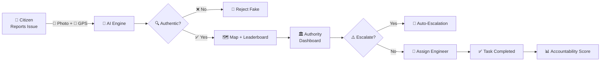
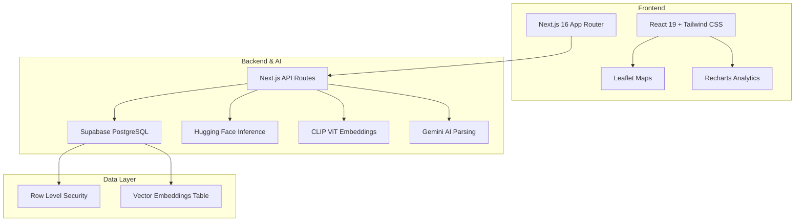
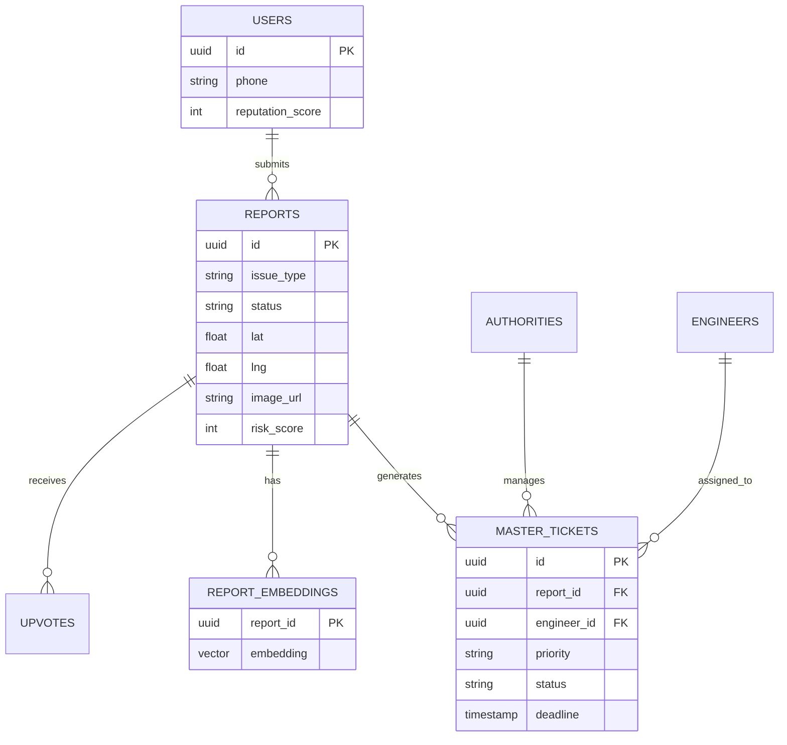

<div align="center">

  <a href="#"></a>

  # 🏛️ JanaVaani — India's First AI-Powered Civic Infrastructure Safety Network

  

  <p><strong>Bridging the gap between citizens and authorities with AI, transparency, and real-time accountability.</strong></p>

  <p>
    <a href="https://nextjs.org/"></a>
    <a href="https://reactjs.org/"></a>
    <a href="https://supabase.com/"></a>
    <a href="https://huggingface.co/"></a>
    <a href="#"></a>
    <a href="#"></a>
  </p>

  <p>
    <a href="#-problem-statement"></a>
    <a href="#-solution"></a>
    <a href="#-live-demo"></a>
    <a href="#-architecture"></a>
  </p>

</div>

---

## 🎯 Problem Statement

> **Build an AI-powered civic infrastructure safety & accountability platform that enables citizens to report public infrastructure issues, allows authorities to triage and assign tasks to engineers, and creates a transparent, data-driven ecosystem for resolving civic problems like road damage, bridge cracks, water supply issues, and more.**

India's public infrastructure — roads, bridges, water supply, and public buildings — faces a massive accountability gap. Citizens struggle to report issues, authorities lack real-time visibility, and resolution is slow, opaque, and disconnected. **JanaVaani** solves this by putting AI, geolocation, and transparency at the center of civic problem-solving.

---

## 💡 Solution

**JanaVaani** is a **three-portal intelligent ecosystem** that connects **Citizens → Authorities → Engineers** in a seamless, AI-augmented workflow:

| Portal | Who | What They Do |
|--------|-----|--------------|
| 🏠 **Citizen** | Public | Report issues via photo/voice, track on live map, upvote problems |
| 🏛️ **Authority** | Govt Officials | Triage reports with AI risk scores, assign engineers, monitor analytics |
| 🔧 **Engineer** | Field Staff | Receive tasks, upload inspection evidence, mark resolution |

### 🌟 The Full Workflow



---

## ✨ Key Features

### 🤖 AI-Powered Intelligence
- **Image Classification** — Hugging Face models auto-detect issue type (road crack, water leak, etc.)
- **Duplicate Detection** — CLIP ViT embeddings identify similar/duplicate reports automatically
- **Authenticity Verification** — AI + EXIF metadata block fake or tampered images
- **Voice-to-Text Reporting** — Speak your complaint; AI parses and structures it

### 🏠 Multi-Portal Architecture
- **Citizen Portal** — Anonymous reporting, live map view, risk score tracking, gamified leaderboard
- **Authority Portal** — Real-time admin dashboard for PWD/municipal/state officials
- **Engineer Portal** — Field task management with evidence upload and status updates

### 📍 Advanced Location & Mapping
- **Auto Geolocation** — GPS + reverse geocoding via OpenStreetMap
- **Interactive Leaflet Maps** — Clustered, color-coded issue visualization
- **Risk Scoring** — Dynamic severity assessment with priority mapping
- **Karnataka District Mapping** — Tailored for state-level infrastructure tracking

### 📊 Analytics & Accountability
- **Real-time Dashboard** — Live metrics, trend analysis, and resolution timelines
- **Gamified Leaderboard** — Citizen engagement via upvotes and reputation scores
- **Accountability Scoring** — Track authority and engineer performance over time
- **Auto-Escalation** — Unresolved issues automatically escalate based on priority & time

---

## 🏗️ System Architecture



---

## 🛠️ Technical Stack

| Layer | Technology | Purpose |
|-------|-----------|---------|
| **Framework** | Next.js 16.2.6 + React 19.2.5 | SSR, App Router, modern React |
| **Styling** | Tailwind CSS + Glass Morphism | Responsive, modern UI |
| **Database** | Supabase (PostgreSQL) | Real-time DB, auth, storage |
| **Security** | Row Level Security (RLS) + Zod | Granular access + input validation |
| **AI/ML** | Hugging Face Inference API, CLIP ViT, Gemini | Classification, embeddings, parsing |
| **Maps** | Leaflet + React-Leaflet | Interactive geolocation visualization |
| **Charts** | Recharts | Analytics dashboards |
| **Forms** | React Hook Form + Zod | Type-safe validation |

---

## 🚀 Live Demo

Try the full end-to-end workflow:

### 🏛️ Authority Portal — `/admin/login`
| | |
|---|---|
| **Email** | `admin@pwd.karnataka.gov.in` |
| **Password** | `password123` |
| *Capabilities* | Review reports, update statuses, assign tasks, view analytics |

### 🔧 Engineer Portal — `/engineer/login`
| | |
|---|---|
| **Email** | `engineer@pwd.karnataka.gov.in` |
| **Password** | `password123` |
| *Capabilities* | View assigned tasks, upload evidence, mark COMPLETED |

### 🏠 Citizen Portal — `/`
No login required! Report issues anonymously with photo + location.

---

## ⚡ Quick Start

```bash
# 1. Clone the repo
git clone https://github.com/Code-odyssey-hackathon/team-25.git
cd team-25

# 2. Install dependencies
npm install

# 3. Configure environment
cp .env.example .env
# Edit .env with your Supabase URL, Anon Key, and Hugging Face API key

# 4. Run locally
npm run dev
# Open http://localhost:3000
```

---

## 🗄️ Database Schema



---

## 🔒 Security & Trust

- ✅ **Row Level Security (RLS)** — Users only see authorized data
- ✅ **AI Fraud Prevention** — Fake/tampered images blocked at pixel level
- ✅ **JWT Sessions** — Secure auth via Supabase
- ✅ **SQL Injection Safe** — Parameterized queries + Zod validation

---

## 📈 Impact & Vision

| Metric | Target |
|--------|--------|
| 🕒 **Report-to-Resolution Time** | Reduce by 60% via auto-triage & assignment |
| 🎯 **Fake Report Detection** | 90%+ accuracy with AI + EXIF validation |
| 📍 **Geographic Coverage** | District-level granularity for Karnataka |
| 🏆 **Citizen Engagement** | Gamified leaderboard drives repeat participation |

> *JanaVaani transforms civic complaint boxes into real-time, AI-driven infrastructure command centers.*

---

## 👥 Team

<div align="center">

  <h2>🏆 Team 25 — <code>Run Time Error</code></h2>
  <p><em>Code Odyssey Hackathon 2026</em></p>

  <table>
    <tr>
      <td align="center"><strong>Role</strong></td>
      <td align="center"><strong>Focus</strong></td>
    </tr>
    <tr>
      <td align="center">Full-Stack Engineering</td>
      <td align="center">Next.js, Supabase, API Architecture</td>
    </tr>
    <tr>
      <td align="center">AI & ML Integration</td>
      <td align="center">Hugging Face, CLIP, Gemini, Embeddings</td>
    </tr>
    <tr>
      <td align="center">UI/UX & Maps</td>
      <td align="center">Tailwind, Leaflet, Dashboard Design</td>
    </tr>
    <tr>
      <td align="center">Database & Security</td>
      <td align="center">PostgreSQL, RLS, Schema Design</td>
    </tr>
  </table>

</div>

---

<div align="center">

  ### 🌟 If you believe in smarter cities, star this repo! 🌟

  <p>Built with ❤️, ☕, and a lot of <code>console.log</code> by <strong>Team 25 — Run Time Error</strong></p>
  <p><em>Code Odyssey Hackathon 2026</em></p>

  <a href="https://github.com/Code-odyssey-hackathon/team-25">
    
  </a>

</div>